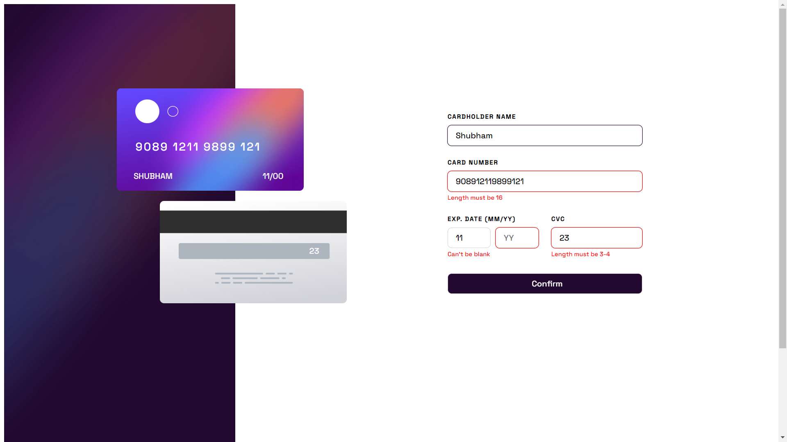

# Frontend Mentor - Interactive card details form solution

This is a solution to the [Interactive card details form challenge on Frontend Mentor](https://www.frontendmentor.io/challenges/interactive-card-details-form-XpS8cKZDWw).

## Table of contents

- [Overview](#overview)
  - [The challenge](#the-challenge)
  - [Screenshot](#screenshot)
  - [Links](#links)
- [My process](#my-process)
  - [Built with](#built-with)
  - [What I learned](#what-i-learned)
  - [Useful resources](#useful-resources)
- [Author](#author)

## Overview

### The challenge

Users should be able to:

- Fill in the form and see the card details update in real-time
- Receive error messages when the form is submitted if:
  - Any input field is empty
  - The card number, expiry date, or CVC fields are in the wrong format
- View the optimal layout depending on their device's screen size
- See hover, active, and focus states for interactive elements on the page

### Screenshot

### Links

- Live Site URL: [Solution Link](https://shubham-kpl.github.io/interactive-card-details-form-main/)

## My process

### Built with

- Semantic HTML5 markup
- CSS custom properties
- Flexbox
- CSS Grid
- JavaScript

### What I learned

It was a great project. It acted as a source of revision of the concepts that I had learnt in JavaScript a long time ago. It was a lengthy project (for me), took almost a week. But yeah, at the end, it was worth it!!

### Useful resources

- [Example resource 1](https://chat.openai.com) - Reached out ChatGPT whenever stuck at a problem

## Author

- LinkedIn - [Shubham Kandpal](https://www.linkedin.com/in/shubham-kandpal-59870322a/)
- Frontend Mentor - [@Shubham-Kpl](https://www.frontendmentor.io/profile/Shubham-Kpl)
- Twitter - [@Shubham27200503](https://www.twitter.com/Shubham27200503)
